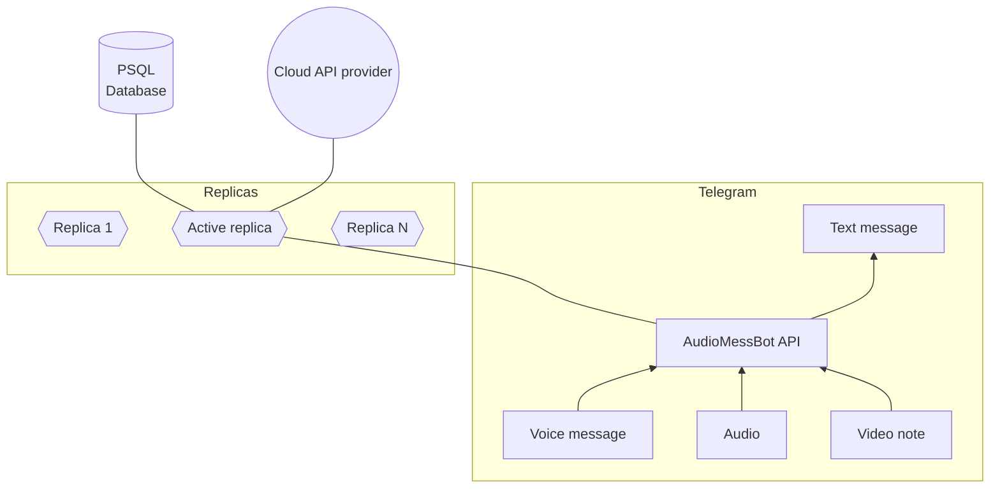

    

    
        
    
    
        
    
    
        
    
    
        
    
    
        
    

# Telegram Bot Converts Voice Messages Into Text

  

This is the simple bot that converts voice into text.
I tried to review available public speech recognition services
and the results you can see below in the table.

# Tech Stack

- [Typescript](https://www.typescriptlang.org/)
- [Fastify](https://fastify.dev/)
- [Axios](https://axios-http.com/)
- [PostgreSQL](https://node-postgres.com/)
- Google Analytics
- [Amplitude](https://amplitude.com/)

# Service model

# Services overview

| Service provider                                                                                | Russian lang | Synchronous API | Duration limitation      | File upload     | Speed                   |
| ----------------------------------------------------------------------------------------------- | ------------ | --------------- | ------------------------ | --------------- | ----------------------- |
| [IBM Watson](https://www.ibm.com/cloud/watson-speech-to-text)                                   | no           | no              | N/A                      | Unknown         | Unknown                 |
| [Microsoft Azure](https://azure.microsoft.com/en-us/services/cognitive-services/speech-to-text) | no           | no              | N/A                      | Unknown         | Unknown                 |
| [Amazon AWS](https://aws.amazon.com/transcribe)                                                 | **yes**      | no              | Unlimited                | S3              | Minutes                 |
| [Google Cloud](https://cloud.google.com/speech-to-text)                                         | **yes**      | **yes**         | 1 minute\*[1] | Direct / GDrive | Instant\*[2] |
| [Wit.ai](https://wit.ai)                                                                        | **yes**      | **yes**         | 5 minutes                | Direct          | Instant                 |

- For direct upload
   
  1 Unlimited for asynchronous upload via Google Drive
   
  2 Takes a while for asynchronous upload via Google Drive
